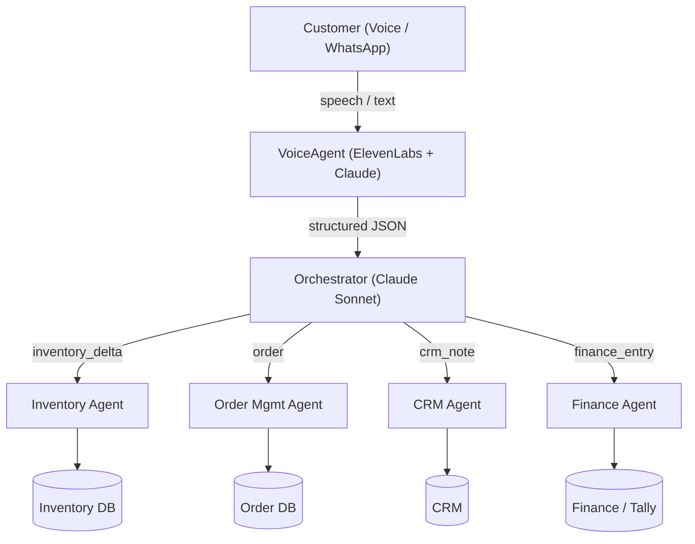

# Agentic Commerce Architecture — Janata Masala

## Overview

Customer interactions (voice, WhatsApp) flow through AI agents that produce structured output, orchestrated by Claude, updating Inventory, Orders, CRM, and Finance systems.



## Structured output schema (post-conversation)

```json
{
  "order": { "items": [], "total": 0, "customer_id": "" },
  "inventory_delta": [{ "sku": "", "qty": -1 }],
  "crm_note": { "type": "enquiry", "summary": "" },
  "finance_entry": { "type": "receivable", "amount": 0 }
}
```

## Demo vs production

| Layer | Demo (M1) | Production (future) |
|-------|-----------|---------------------|
| Voice | ElevenLabs WebRTC | Same + JM-trained persona |
| Orchestrator | Claude API structured output | Same + tool use to real APIs |
| Systems | Animated flow diagram | Tally, inventory ERP, CRM webhooks |
