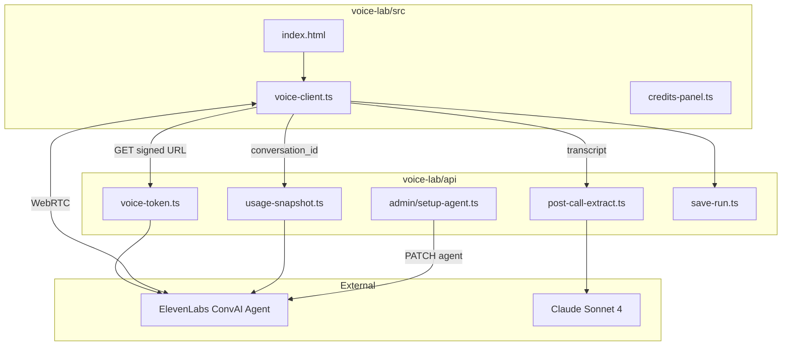

# TRD — Janata Masala Voice Lab

**Version:** v1.0.0  
**Last updated:** 2026-06-12

---

## 1. Architecture overview

**Pattern:** Browser ConvAI (JM signed-URL) + insurance ops discipline + Claude post-call extraction.



**Split brain:**
- **ElevenLabs** — real-time voice (STT + Sonnet in-call + TTS)
- **Claude API** — post-call structured extraction (JM schema from `api/chat.ts`)

---

## 2. Repository layout

```
voice-lab/
├── docs/PRD.md, TRD.md
├── api/
│   ├── voice-token.ts
│   ├── post-call-extract.ts
│   ├── usage-snapshot.ts
│   ├── save-run.ts
│   └── admin/setup-agent.ts
├── src/
│   ├── index.html
│   ├── voice-client.ts
│   ├── credits-panel.ts
│   └── styles.css
├── data/catalog.demo.json
├── prompts/
├── workflows/elevenlabs/agents/jm-v1/
├── scripts/
├── outputs/          # gitignored runs
├── .env.example
├── vercel.json
└── package.json
```

Run from `voice-lab/`: `npx vercel dev`

---

## 3. Technology stack

| Layer | Choice |
|-------|--------|
| Voice realtime | ElevenLabs ConvAI + `@elevenlabs/client` Web SDK |
| In-call LLM | `claude-sonnet-4` (ElevenLabs slug; not Anthropic API model id) |
| Post-call | `claude-sonnet-4-20250514` via Anthropic API + `json_schema` |
| Backend | Vercel serverless (TypeScript) |
| Frontend | Static HTML + TS (esbuild bundle or native ESM) |
| Catalog | `catalog.demo.json` → agent knowledge via setup script |

---

## 4. API specifications

### `GET /api/voice-token`

Returns `{ signedUrl }` from ElevenLabs `get-signed-url`. Env: `ELEVENLABS_API_KEY`, `ELEVENLABS_AGENT_ID`.

### `POST /api/post-call-extract`

**Request:** `{ transcript, session_id, catalog_version }`  
**Response:** `{ structured, validation, usage, meta }`

- Claude Sonnet 4 with JM JSON schema
- SKU must exist in catalog
- Returns `usage.input_tokens`, `usage.output_tokens`, estimated USD/INR

### `GET /api/usage-snapshot`

**Query:** `?conversation_id=...` or `?balance=true`

- Conversation: `GET /v1/convai/conversations/{id}` → `metadata.charging`
- Balance: `GET /v1/user/subscription` → character credits remaining

### `POST /api/save-run`

Persists session artifacts to `outputs/runs/{sessionId}/`.

### `POST /api/admin/setup-agent`

PATCH ElevenLabs agent from repo prompts. Guard: `JM_VOICE_ADMIN_TOKEN`.

---

## 5. ElevenLabs agent configuration

| Setting | Value |
|---------|-------|
| Name | `JM Voice Lab B2C v1` |
| LLM | `claude-sonnet-4` |
| TTS | `eleven_flash_v2_5` |
| Tools | `language_detection`, `end_call` |
| Languages | `hi`, `en` presets + `hinglish_mode`; Gujarati/Marathi via detection + prompt |
| Max duration | 600s |
| Turn | 8s timeout, soft filler, 18s silence end |

Created/idempotently patched via `scripts/create-or-patch-agent.js`.

---

## 6. Bootstrap technical founder

### Complexity budget

- v1 target: **~600–900 LOC**, 5 API routes, 1 HTML page
- **NOT building:** telephony, webhooks, CRM writes, WhatsApp send, LLM judge, auth, database, workflow canvas
- Single-prompt agent unless list-dump fails in testing

### Computer / environment

- Chrome or Edge (WebRTC mic)
- Node 20+, `npx vercel` CLI
- Mic + speakers; stable internet
- `.env.local`: `ELEVENLABS_API_KEY`, `ANTHROPIC_API_KEY`, `ELEVENLABS_AGENT_ID`

### Scaling (honest)

| Stage | What |
|-------|------|
| **Now** | 1 dev, 1 browser, `vercel dev` in `voice-lab/` |
| **Next** | Port routes to main app `api/`; wire into explorations (UX TBD) |
| **Later** | Post-call webhook when concurrent calls matter |
| **Never v1** | Multi-tenant, rate limiting, KV |

### Bare-minimum instrumentation

Per session → `outputs/runs/{sessionId}/`:

| File | Contents |
|------|----------|
| `transcript.txt` | Full conversation |
| `structured.json` | Extraction + validation |
| `usage.json` | EL + Claude credits |
| `meta.json` | versions, agent_id, timestamps |

Append-only: `outputs/analytics/session_ledger.csv`

### Credits tracking

| Provider | Source | UI shows |
|----------|--------|----------|
| ElevenLabs | `conversations/{id}` charging | call_charge, llm_charge, duration |
| ElevenLabs balance | `/v1/user/subscription` | credits remaining |
| Claude | Messages API `usage` | in/out tokens, ~USD/INR |

Footer: **"This session: EL X credits · Claude Y in / Z out · ~₹N"**

### Feedback loops

1. Schema validation on every extraction
2. SKU grounding against catalog
3. Golden transcripts in `test-extraction.js`
4. Thumbs up/down → ledger CSV
5. No LLM judge in v1

### Cost guardrails

- Max call 600s (agent + UI timer)
- Soft warning at 8 min
- Block start if credits &lt; 5% (`JM_MIN_CREDITS_PCT`)

### Expected credits per session

| Component | Typical |
|-----------|---------|
| ElevenLabs | 500–2000 credits / 3–5 min (from API, not estimated) |
| Claude post-call | 1.5k–4k tokens (~$0.01–0.04) |
| Per demo | ~$0.05–0.15 all-in |

---

## 7. Environment variables

```bash
ELEVENLABS_API_KEY=
ELEVENLABS_AGENT_ID=
ELEVENLABS_VOICE_ID=          # optional
ANTHROPIC_API_KEY=
ANTHROPIC_MODEL=claude-sonnet-4-20250514
JM_VOICE_ADMIN_TOKEN=
JM_CATALOG_VERSION=demo-v1
JM_PROMPT_VERSION=v1.0.0
JM_MIN_CREDITS_PCT=5
USD_INR_FX=83
PUBLIC_BASE_URL=http://localhost:3000
```

---

## 8. Local development

```bash
cd voice-lab
cp .env.example .env.local
# fill keys
npm install
node scripts/create-or-patch-agent.js
npx vercel dev
```

---

## 9. Integration path (post-v1)

| Voice lab | Main app |
|-----------|----------|
| `api/voice-token.ts` | Existing `api/voice-token.ts` |
| `api/post-call-extract.ts` | Extend `api/chat.ts` structured mode |
| `voice-client.ts` | New component near `VoiceAgent.tsx` |
| Prompts + catalog | Replace `ConversationSimulator` when live |

No main-app work until S1–S9 pass in standalone lab.

---

## 10. Security

- API keys server-side only
- `.env.local` gitignored
- Admin endpoint token-gated
- UI label: "Demo — not production JM system"
